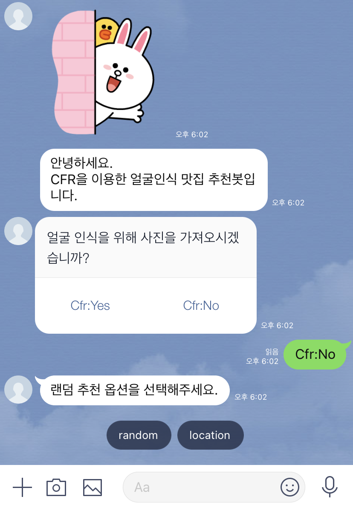

새로운 사람들을 만날때마다 자주 듣는 질문이 있다. 왜 컴퓨터공학과에 가게 되었는지, 어떻게 개발을 시작했는지, 왜 프론트엔드 개발자가 되었는지 등등...
사실 매 선택에 거창한 이유가 있었던 건 아니지만,
비슷한 선택의 기로에 놓인 사람들에게 조금이나마 도움이 되기를 바라는 마음으로 쭉 일대기를 적어보려고 한다 🙏

# 컴퓨터공학과에 입학하기까지

컴퓨터와의 인연은 초등학교때로 거슬러 올라간다. 내 동년배들은 공감할 것 같은데 그 당시 학교에 방과후 수업이 종류별로 진짜 많았다. 그 중 하나로 오전에 컴퓨터 수업을 들었고,
한글・PowerPoint・Excel을 공부하고 자격증을 땄었다. 자격증 3개 다 A등급을 맞아 ITQ OA Master도 받았었다 ㅎ

시에서 초등학생을 대상으로 워드 대회를 개최했었는데, 선생님 추천으로 4 ~ 6학년동안 학교대표로 나가 상도 받아왔었다.

이렇게 조금씩 성취감을 느끼다보니 컴퓨터에 흥미를 가진 것 같다. 그렇다고 혼자서 컴퓨터를 만지거나 공부한 건 전혀 아니였다.
컴퓨터공학과에서 배우는 과목이나 지금 하는 개발과는 거리가 매우 먼 활동이였지만, 이때의 경험이 아니였으면 컴퓨터라는 길을 생각도 하지 못했을 걸 생각하니 아찔하기도 하다.

중고등학교때는 오히려 컴퓨터를 거의 만질일이 없었다. 내 개인 컴퓨터나 노트북은 당연히 없었고, 발표준비를 위해 ppt를 만들거나 이런일이 아니면 거의 컴퓨터를 쓸일이 없었다.
그런데 정말 뜬금없이, 이제 희망하는 학과를 생각해야할 시기가 다가왔을 때 컴퓨터가 문득 떠올랐다.

지금생각하면 좀 무모했던 것 같은데, 컴퓨터공학과에서 뭘 배우는지 하나도 모르는채로 단지 초등학교때 컴퓨터 수업을 들었던 경험만으로 컴퓨터공학과에 가야겠다고 생각했었다.
그래도 고등학교때 수학과목을 제일 좋아했고, 실용적인 학문을 배우는 공대가 끌렸다. 여기에 컴퓨터가 더해져서 결국 모든 원서를 컴퓨터공학과로 쓰게 되었고, 그렇게 대학교에 입학했다.

# 대학교 1학년

### 1학기

그렇게 기대하고 입학한 컴퓨터공학과는... 너무 힘들었다.
`컴공 입학하면 웹사이트나 핸드폰 앱 같은거 만들겠지?`라고 생각했던거와는 완전히 달랐다.

컴퓨터공학과 신입생들은 1학기에 모두 파이썬 수업을 다같이 들었는데, 이게 너무 힘들었다. 컴퓨터도 잘 모르다 보니 수업에서 사용하는 주피터를 설치하는 것 자체도 나한텐 어려웠다.

예를 들어보면, 파이썬으로 사칙연산하는 **문법**만 알려줬으면서 시험에서는 갑자기 가위바위보하는 프로그램을 짜라고 하는데... 이게 정말 어려웠다.
그렇게 학기 중간부터는 거의 진도를 따라가지도 못했고, 시험은 당연히 망치고, 프로젝트 역시 그냥 동기들이 하는걸 보고 따라내기가 바빴다.
그 수업에서 컴퓨터공학과 학생이라면 당연히 A+ 받아야한다 라는 말이 많았는데 나는 그러지 못한게 속상하기도 했고, 수업시간에 이해를 하지 못해 멍때렸던 시간들을 2학기에는 되풀이하고 싶지 않았다.

### 여름방학

내가 다녔던 학교의 컴퓨터공학과는 과 동아리별로 여름방학을 이용해 신입생 교육을 진행했었다. 교육내용은 2학기에 배우는 C++이였다.

이 교육도 처음에는 따라가기 힘들었다. 마찬가지로 문법을 배우는건 따라가겠는데, 갑자기 `5!`를 구현하는 코드를 작성해라 라고 하면 막혔다.
그래도 훨씬 질문하기 편한 선배와 동기들이 있었고, 학기중과는 달리 C++ 하나에만 집중할 수 있으니 배웠던 문법에서 시작해 어떻게 원하는 코드를 작성할 수 있는지 계속 고민해보려고 했다.

그러다보니 간단한 프로그램을 직접 짤 수 있게 되고, 이런 과정을 반복하다보니 갑자기 '아 이런걸 **컴퓨팅적 사고**라고 하는구나' 라는 느낌이 왔다.
신기하게 이 생각이 든 이후부터는 오히려 코드를 이용해 문제를 푸는 과정에서 재미를 느낄 수 있었다. 교육이 끝난 이후에도 집에 내려가서 혼자 코드를 짜보기도 했다.

### 2학기

예습의 힘인지, 2학기에 배우는 C++ 수업은 진짜 열심히 들었다. 수업시간에 배우는 내용이 이해가 되고, 퀴즈시간에 제출을 할 수 있게 되니 수업이 더 재밌어지고, 성적도 올라갔다.
또 욕심이 나서 C++ 수업뿐만 아니라 다른 전공, 교양 수업도 더 열심히 들었다.

# 대학교 2학년

### 1학기

이제 학교 수업은 재밌었다.
코로나로 인한 비대면 수업인 점도 있었고, 나도 웹이나 앱을 만들고 싶었지만 어떻게 하는지 알지 못해서, 그냥 지금 할 수 있는 이론 공부를 최대한 하자라고 생각했다.
그래서 학점우수 추가학점도 꽉꽉채워 1년동안 총 `45학점`을 들었다.

비대면이여서 가능했던 점도 있겠지만, 나중에 개발을 할 수 있게 되면 거기에 시간을 좀 더 쏟고싶어서 전공필수 CS 과목들을 미리 다 들어두었다.

### 2학기

그런데 이제 2학기가 시작되고, `어? 벌써 대학교의 절반이 지나갔는데 여전히 난 개발을 어떻게 하는지도 모르네` 라는 생각이 왔다.
나도 무언가라도 만들어보고 싶은데, 어떻게 만드는지를 몰랐다. 학교에서도 안알려줬다.

위기감도 오면서 불안해졌고, 매일 어떻게 개발 공부를 시작 해야하는지 인터넷에 찾아봤다.
하지만 광고글도 많고, 어떤게 맞는길인지 판단을 할수가 없으니 그냥 매일이 막연하기만 했다.

이때 처음으로 프로젝트 수업을 들었는데, 여기서 `Git`도 처음 써보고 `Node.js`로 챗봇을 만드는 것을 배웠다.
그리고 기말 프로젝트로 직접 챗봇을 만들게 되었는데, 이때는 Node.js가 JavaScript인지도 몰라서 그냥 인터넷에 꿋꿋하게 node.js만 검색해서 코드를 붙여넣어가며 프로젝트를 제출했다.
지금보면 엉망인 코드지만, 이 프로젝트를 통해 `나도 무언가를 직접 만들 수 있구나`라는 생각을 처음 가지게 되었다.

어떻게보면 `나는 개발에 대해 아무것도 배운적이 없고 모르니까 나는 아무것도 만들 수 없어` 라는 두려움으로 시작을 회피했었던 것 같다.
이제는 정말 개발을 시작해보고 싶다는 생각에, 교수님께 '어떻게 개발을 시작해야할지 모르겠는데 알려주실 수 있냐' 라고 메일을 보냈다.
교수님께서는 흔쾌히 수업시간에 개발자에는 크게 어떤어떤 길이 있는지 설명해주셨고, 이때 프론트, 백엔드, 모바일 등의 분야를 알게 되었다.

# 대학교 3학년

### 개발시작

수업으로 얻은 자신감 + 교수님께서 알려주신 내용을 바탕으로 겨울방학을 이용해 정말 어떻게든 개발을 시작해야지 라고 결심했다.
어떻게 시작할까 고민했었는데, 이왕 시작인거 제일 기초부터 시작하고싶었다. 제일 쉬운거부터!

그래서 난 `HTML`을 선택했다. `HTML`도 공부까지 해야하나? 라고 생각할 수 있는데(나도 그랬다), 난 좋은 시작이였다고 느낀다.
쉬우니까 금방금방 진도가 나가고, 그냥 태그만 추가해도 웹 페이지로 바로 볼 수 있으니까 재밌었다.

`HTML`로만 웹페이지 만들다보니 밋밋해서 `CSS`를 공부했고, 이제 클릭했을때 반응이 있었으면 좋겠어서 `JavaScript`를 공부하게 되었다. (HTML, CSS는 무료 인터넷 강의로, JavaScript는 MDN 공식문서와 무료 클론코딩 강의 보고 공부했다)

막연하기만 했던 개발이, 막상 시작해보니 `이런 기능을 추가하고 싶은데, 그럼 이걸 배우면 되겠구나` 이렇게 착착 흘러갔다.

### 경험쌓기

1학기가 시작하고, 동아리에서 React 스터디를 시작한다는 이야기를 들었다. 아직 JavaScript도 잘 모르지만, JavaScript 다음으로 React를 공부해야지 라고 생각하고 있었어서 바로 들어갔다.

스터디는 한명씩 자기 파트를 맡아 React 공식문서를 공부해오고 다른사람들에게 설명하는 식으로 진행했었는데, 꽤 재밌게 배울 수 있었다.
스터디 마지막에는 각자 React로 게임을 만들어오고, 이를 Github pages로 배포하도록 알려주셨는데, 이 덕분에 처음으로 웹페이지를 처음부터 끝까지 만들고 공유까지 해볼 수 있었다.

이 이후로는 학점도 거의 다 채워놨겠다, 계속해서 새로운 경험을 쌓는데 집중했다.

- 여름방학에는 현장실습을 했다.
  - Git을 이용해 어떻게 협업하는지 배웠다.
  - 개발 전 컴포넌트 설계, 데이터 흐름 설계 과정을 배우면서 좀 더 현업에 가까운 경험을 할 수 있었다.
- 2학기에는 학부연구생을 하면서 iOS 개발을 했다.
  - iOS 개발이 생각보다 재미있어서 분야에 대한 고민을 했다. 어떤 분야를 선택해야할지 가장 고민이 많았던 시기였다.
- 겨울방학에는 IT 동아리에 참여했다.
  - 디자이너, 백엔드, 프론트엔드 개발자와 협업하면서 서비스를 만드는 좋은 경험이었다.
  - 데드라인이 있는 서비스 개발을 하면서 협업 툴들을 활용해 어떻게 협업 효율을 올릴 수 있는지 배웠다.

# 대학교 4학년

대망의 4학년이 되고 나서, 이제 정말 취업준비를 시작해야겠다는 생각에 알고리즘 스터디를 시작했다. 1학기에는 졸업 요건이 안되는 공고가 많았는데 코테 경험을 쌓고자 많이 지원했었다.
그리고 코테에 줄줄이 떨어졌다... (알고리즘 공부는 미리미리 하자 ㅜㅜ)

그렇게 상반기에는 `알고리즘 공부 + SW마에스트로` 활동을 하면서 보냈고, 하반기부터 취준을 시작했다.
이제 코테를 통과해 면접을 보기 시작했는데, 처음 본 기술면접에서 탈탈 털리기도 하고, 최종면접에서 떨어지기도 하면서 면접에 대한 두려움이 좀 커졌다.

그렇게 종강 전 마지막으로 본 면접들을 통해, 아쉽게도 취업은 하지 못하고 네이버에서 체험형 인턴을 시작하게 되었다.

### 졸업

열심히 학점을 따긴 했지만, 수치적으로 그렇게 높은 학점은 아니였고 한번도 학기 수석을 한적이 없어서 전혀 기대를 안하고 있었는데, 졸업식을 앞두고 총장상 수여 전화가 왔다.
4년간 우여곡절을 겪으면서 다녔던 학교를 수석 졸업으로 기분좋게 마무리 한 것 같아서 좋았다.

# 취준

네이버에서 체험형 인턴을 시작했다. 인턴 시작과 동시에 이전에 면접을 본 유니콘기업에서 추가합격 제의가 왔다.
이 이후에 취업시장이 이렇게 차가워질 줄 알았으면 체험형 인턴따위 바로 포기하고 입사했을텐데, 이때는 뭔가 근거없는 자신감 + 제대로 취준 해보고 첫 회사를 가보고싶다 라는 생각에 입사를 거절했다.
(하지만 이후에 취준하면서 죽도록 후회했다...)

그렇게 인턴십을 6개월동안 진행했었다. 인턴십과 병행해서 일에 어느정도 익숙해지고 난 후 이제 본격적인 취준을 시작하려고 했는데, 모집하는 회사가 없었다.
그래서 네이버를 포함해 총 3개의 회사에만 지원을 할 수 있었고, 운이 좋게 네이버 공채에 합격하여 인턴 퇴사와 동시에 신입으로 입사를 하게 되었다.
운이 좋은건지 나쁜건지, 두 시기가 절묘하게 안겹쳐서 금요일날 인턴 퇴사를 하고 월요일에 바로 출근했다.

# 신입 개발자

어제 입사한 것 같은데, 벌써 6개월이 지나가서 놀랍다(평생 신입이고 싶다).

입사한 이후로 회사생활은 어떤지 질문 받을때마다 과분한 회사인 것 같다고 말하곤 하는데, 정말로 좋은 환경에서 좋은 분들과 개발자로서의 첫 시작을 함께할 수 있어서 감사하고, 또 과분하다.

꽤나 간추려서 지금까지의 이야기를 적어봤는데, 이 기간동안 정말 스트레스도 많이 받고, 고민도 많이하고, 좌절도 많이하고, 걱정은 누구보다 많이 했다. 지금 생각해보면 지나치게 많은 걱정을 하고 스스로에게 스트레스를 줬던 것 같기도 하다.

주변의 친구들이나 후배들을 볼때 비슷한 고민을 많이 하고 있는 것 같았다.
고민은 스스로 극복할 수 밖에 없지만, 비슷한 고민을 이미 겪은 사람으로서 내 경험들이 조금이나마 도움이 되었으면 좋겠다.

마지막으로 내가 가장 많이 고민했던 내용들에 대한 의견을 적어보았다. (그냥 사람 한명의 의견이라 생각하고, 결정은 본인이 해야한다. 나도 아직 신입이라 정답은 모르겠다.)

- 컴공이 적성에 안맞는 것 같다
  - 재미가 없는건지, 진짜 못해먹겠는건지 잘 생각해보자. 재미가 없는건 당연한거라 생각한다.
  - 재미가 없어도 꾸역꾸역 할수는 있다 정도만 되어도 난 적성에 맞는거라 생각한다...
- 프론트, 백엔드.. 어떤 분야를 선택할지 모르겠다
  - 일단 아무거나 시작해보자. 어차피 언젠가는 둘 다 해보게 될 확률이 높고, 그때 더 재밌는걸 선택하면 되지 않을까.
  - 분야를 바꾸더라도 이전 경험이 시간낭비라고 생각하지 않는다. 다 어떻게든 도움이 되더라.
- 다른 사람들은 날고기는데, 나는 너무 늦은 것 같다
  - 내가 대학교 다니면서 맨~~날 했던 생각인데, 컴퓨터 앞에 앉아있는 시간만큼 느니까 욕심만 있다면 **어느정도까지는** 금방 성장할 수 있다.
  - 비교도 좋은 원동력이 되었다. 무기력할때 저렇게 잘하는, 열심히 사는 사람도 있구나 생각하면서 일어나곤 했다.
