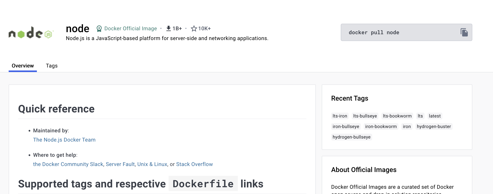
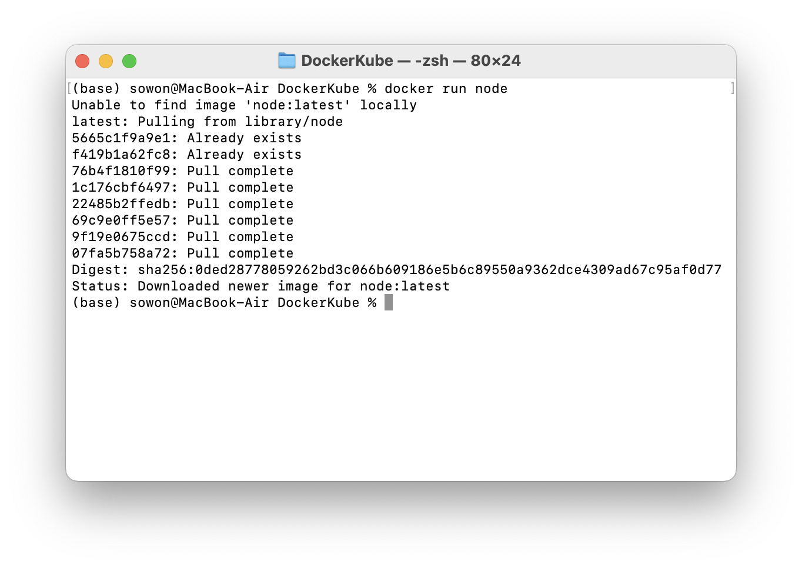
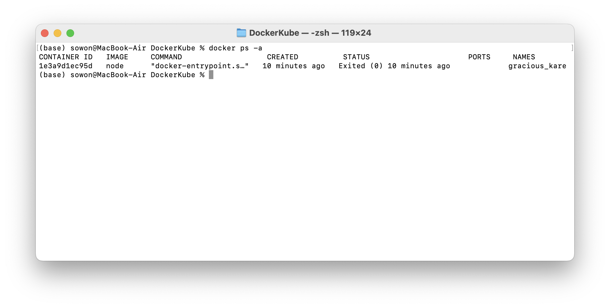
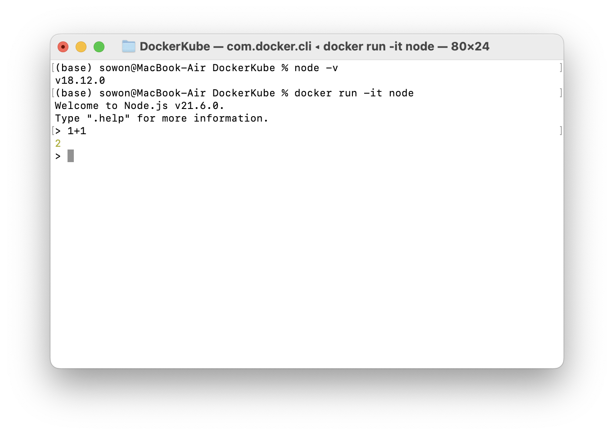
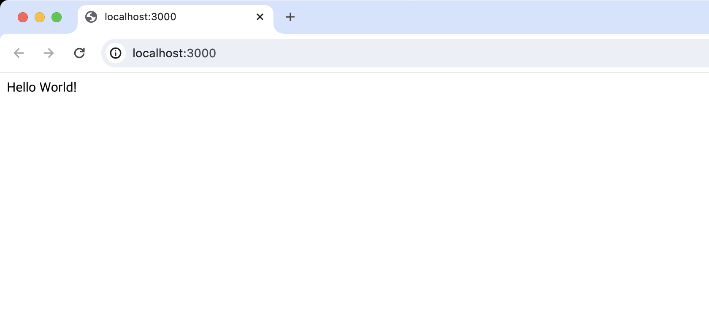
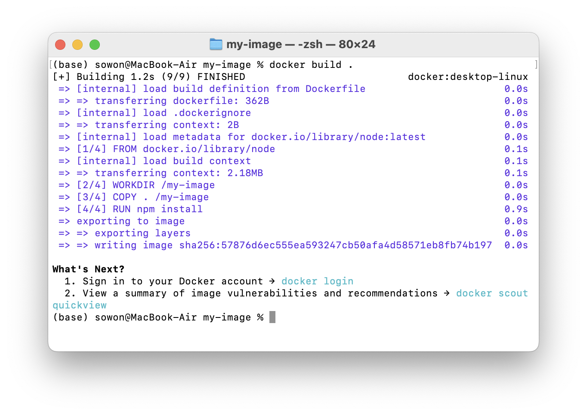
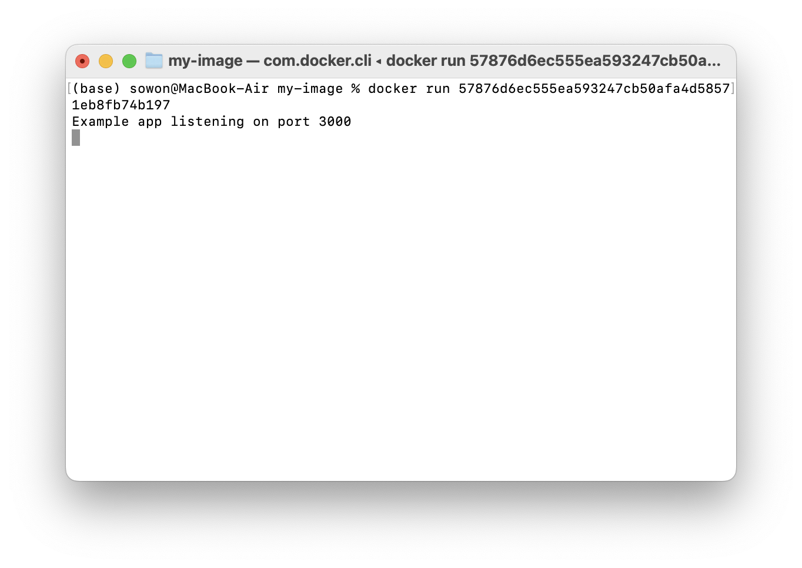
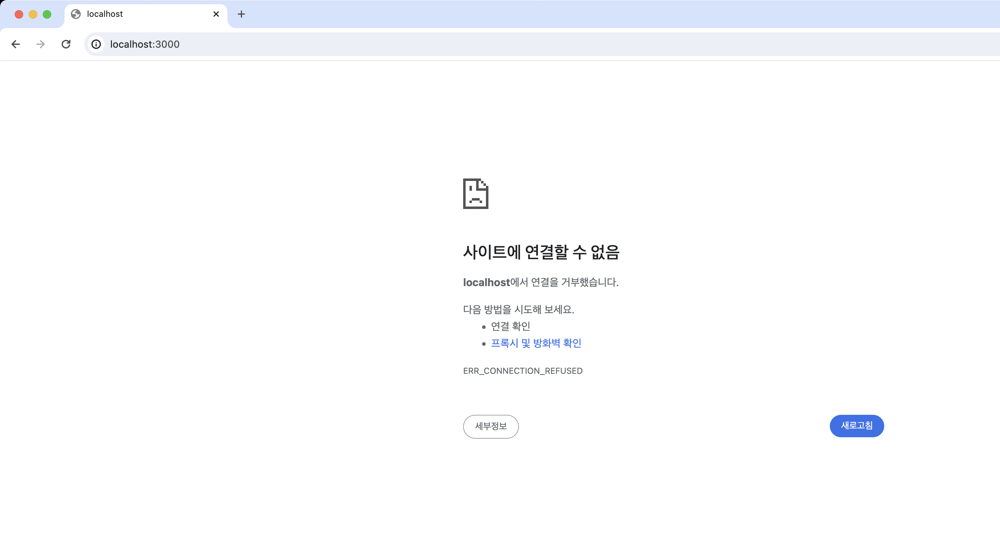
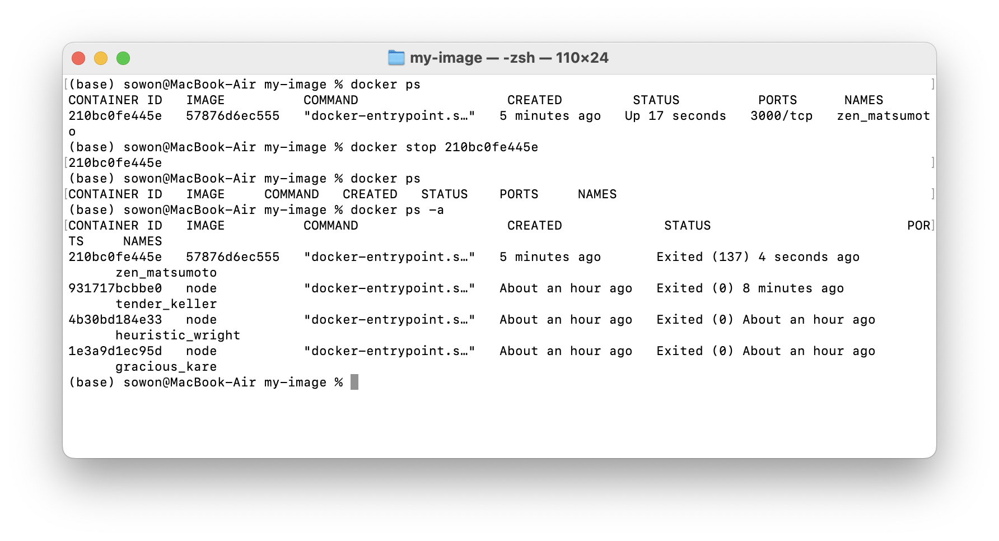
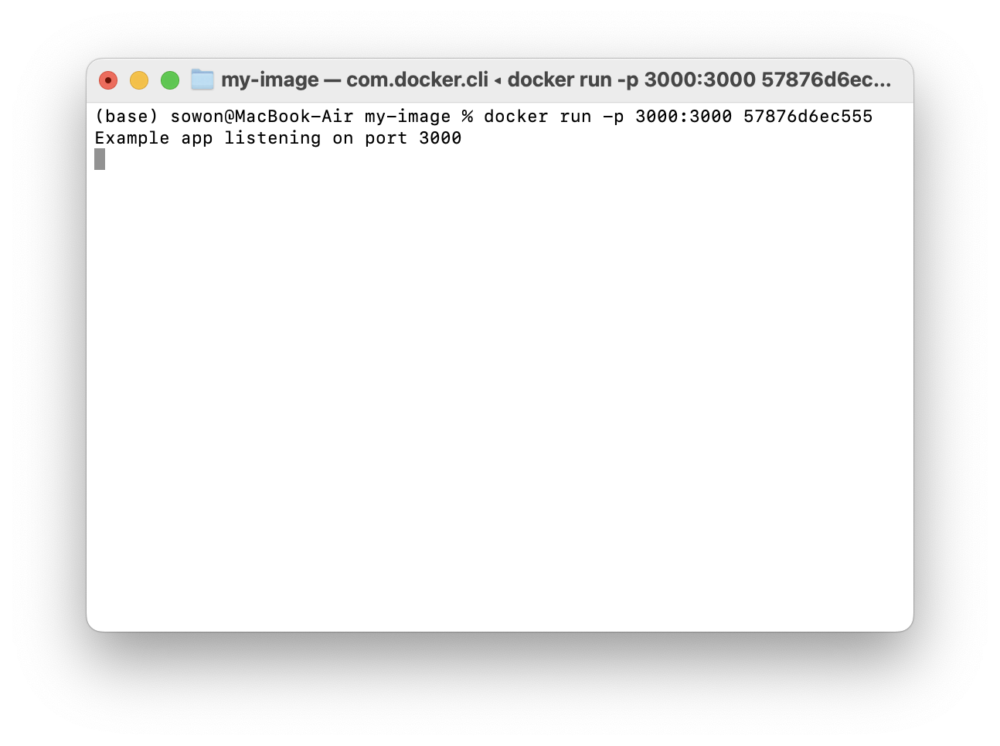

> 본 포스트는 Udemy [【한글자막】 Docker & Kubernetes : 실전 가이드](https://www.udemy.com/course/docker-kubernetes-2022/) 강의를 수강하고 작성한 학습후기입니다.
> 도커에 대한 기본적인 개념 및 작업환경 설정은 [Section1 : 시작하기](https://www.udemy.com/course/docker-kubernetes-2022/learn/lecture/30289080#overview) 에서 무료로 수강할 수 있습니다.

# 이미지, 컨테이너란?

도커를 공부하다보면 항상 등장하는 이미지와 컨테이너는 무엇일까?

- 이미지
  - 코드와 코드를 실행하는데 필요한 도구가 포함된 패키지
  - 컨테이너의 템플릿
- 컨테이너
  - 이미지의 실행 인스턴스

즉, **이미지를 기반으로 컨테이너를 실행**하는 것이다.

이제 컨테이너를 실행하기 위해서는 이미지가 필요한 것을 알았다. 이미지는 어디서 얻을 수 있을까?

## 1. 이미 존재하는 이미지 사용

[Docker Hub](https://hub.docker.com/)에 접속해보면 다양한 이미지를 검색할 수 있다.

`node`를 검색해보자. 아래와 같이 노드에서 지원하는 [공식 도커 이미지](https://hub.docker.com/_/node)를 찾을 수 있다.



이 이미지를 가져와서 컨테이너를 실행해보자. 단 한줄의 명령으로 가능하다.

```shell
docker run node
```



한 줄의 명령을 통해 `1) 로컬에서 이미지가 없음을 확인하고`, `2) 도커 허브에서 이미지를 가져오고`, `3) 이미지를 로컬에 다운로드한 뒤`,
`4) 그 이미지를 기반으로 컨테이너를 생성한다`.

이제 `node` 이미지를 기반으로 도커 컨테이너가 실행되었다.
일반적으로 노드를 실행하면 명령을 입력할 수 있는 인터렉티브 쉘이 등장하는 것과 달리, 우리의 터미널은 아무런 변화가 없다.
내 컨테이너는 어디로 갔을까? 제대로 생성된게 맞을까?

먼저 `docker ps -a` 명령을 통해, 실제로 컨테이너가 생성되었음을 확인할 수 있다.
(여기서 `ps`는 프로세스를 의미한다. `-a`는 도커가 생성한 모든 프로세스(컨테이너)를 표시하는 플래그이다.)



컨테이너가 생성되었는데 왜 노드 환경을 사용할 수 없을까?
기본적으로 **컨테이너는 주변 환경과 격리**되어 있다.
따라서 컨테이너 내부에서 실행중인 인터렉티브 노드 쉘이 있다고 해서, 이 쉘이 우리에게 노출되는 것은 아니다. 🥲

하지만 당연히 노출하도록 설정할 수 있다.

```shell
docker run -it node
```

`-it` 플래그를 통해, 도커에게 컨테이너 내부에서 호스팅 머신으로 인터렉티브 세션을 노출하고 싶음을 알릴 수 있다.
이렇게 되면 로컬에서 사용하는 노드 버전과 상관없이, 다른 노드 버전을 설치할 필요 없이 새로운 버전의 노드를 컨테이너에서 바로 사용할 수 있다.



이렇게 Docker Hub에 이미 올라와있는 다양한 이미지를 사용하여 컨테이너를 생성할 수 있다.
하지만 내가 필요한 이미지를 직접 생성할 수 없을까?

## 2-1. 직접 이미지 생성하기

물론 가능하다. 직접 이미지를 생성해보자. 🦾

이미지를 생성하려면 `Dockerfile`을 만들어야한다.

- **Dockerfile**
  - 도커에 의해 식별되는 특별한 이름이다.
  - 이미지를 빌드할 때 도커에게 명령할 내용이 포함된다.

이제 `Dockerfile`을 직접 작성하여 가장 간단한, `Hello World`를 출력하는 express 웹서버를 컨테이너에 띄워보자! ([express 튜토리얼](https://expressjs.com/ko/starter/hello-world.html) 참고, 아래 예제는 강의에서 제공하는 예제와 다르게 직접 작성한 예제입니다.)

먼저 로컬에서 서버를 띄워보자.

```shell
# my-image 디렉토리 생성
mkdir my-image

# my-image 디렉토리 안으로 이동
cd my-image

# package.json 생성
npm init

# express 패키지 설치
npm install express --save
```

이제 `index.js` 파일을 생성하여 [웹서버 코드](https://expressjs.com/ko/starter/hello-world.html)를 추가하자. (pakcage.json 생성 시 지정한 entry 파일로 생성하자)

```javascript
const express = require("express");
const app = express();
const port = 3000;

app.get("/", (req, res) => {
  res.send("Hello World!");
});

app.listen(port, () => {
  console.log(`Example app listening on port ${port}`);
});
```

이제 `node index.js` 명령을 입력하면, <a>http://localhost:3000/</a>에서 웹서버에 접속할 수 있다.



이제 이 웹서버를 로컬 컴퓨터가 아니라, 컨테이너 환경에서 실행해보자. 먼저 이미지를 생성해야한다.
직접 이미지를 생성할때도 일반적으로 공식 베이스 이미지를 가져온 다음, 그 위에 코드를 추가하여 이미지를 생성하는 경우가 많다.

아래는 완성된 도커파일이다.

```dockerfile
# 다른 이미지를 가져옴
FROM node

# 도커 컨테이너의 작업 디렉토리 설정
WORKDIR /my-image

# 컨테이너 내부 폴더로 로컬 파일 복사
COPY . /my-image

# 명령 수행
RUN npm install

# 노출할 포트를 문서화
EXPOSE 3000

# 이미지 생성 후, 컨테이너 시작될 때 실행할 명령
CMD ["node", "index.js"]
```

#### `FROM`

```dockerfile
FROM <이미지>
```

다른 베이스 이미지를 가져온다.

#### `WORKDIR`

```dockerfile
WORKDIR <컨테이너 내부 작업 디렉토리>
```

도커 컨테이너의 작업 디렉토리를 설정한다.
도커에게 후속 명령이 모두 해당 디렉토리 내부에서 실행될 것임을 알린다.

#### `COPY`

```dockerfile
COPY <컨테이너 외부 경로> <컨테이너 내부 경로>
```

`컨테이너 외부 경로`는 이미지로 복사되어야할 파일이 있는 곳이다.
`.`를 넣으면 Dockerfile이 있는 동일한 폴더를 가리킨다. (Dockerfile은 제외됨)

컨테이너는 자체 내부 파일 시스템이 있다.
`컨테이너 내부 경로`는 외부 경로에서 복사해온 파일을 해당 자체 내부 시스템 안에서 저장할 폴더를 가리킨다.
루트 폴더보다는 서브폴더를 사용하는게 좋다. (절대경로, 상대경로 모두 사용가능)

#### `RUN`

```dockerfile
RUN <수행할 명령>
```

수행할 명령을 입력한다. 모든 명령은 컨테이너의 작업 디렉토리에서 실행된다.

#### `EXPOSE`

```dockerfile
EXPOSE <컨테이너 내부에서 노출할 포트>
```

`index.js` 파일에서 정의한대로, 웹서버는 `3000` 포트에서 수신대기하게 된다.

컨테이너 환경은 격리되어있기 때문에, 컨테이너 내부의 노드 애플리케이션에서 포트 `3000`을 수신할 때 컨테이너는 그 포트를 우리의 로컬 컴퓨터에게 노출하지 않는다.

따라서 컨테이너 내부에서만 무언가를 수신 대기중이기 때문에, 컨테이너에서 특정 포트를 노출하고 싶음을 알리는 EXPOSE를 사용한다.

#### `CMD`

```dockerfile
CMD [수행할 명령]
```

이미지가 생성될 때 실행되지 않고(`RUN`), 컨테이너가 시작될때 실행할 명령들을 입력한다.

하나의 이미지를 기반으로 여러 컨테이너를 실행할 수 있다. 따라서 이미지가 생성될 때와 컨테이너가 시작될 때 수행할 명령이 달라지게 된다.
이미지가 빌드될때마다 실행되면 안되고, 컨테이너 시작시에 실행되어야하는 명령들 (ex) 웹서버 시작)을 수행한다.

## 2-2. 직접 생성한 이미지를 컨테이너로 실행하기

이제 `Dockerfile` 작성을 완료했으니, 이를 바탕으로 이미지를 만들고 컨테이너를 실행해보자!

```shell
docker build <도커파일 위치>
```

`build` 명령을 통해 도커파일을 기반으로, 이미지를 빌드할 수 있다. 이떄 Dockerfile을 찾을 수 있는 위치를 알려주어야한다.

`docker build .`명령으로 (현재 도커파일이 위치한 디렉토리 안에 있음) 이미지를 빌드해보자.



실행 결과의 마지막에서 빌드된 이미지 ID를 얻을 수 있다. (이미지에 이름을 지정할 수도 있다. 나중에 알아보자!) 생성된 ID를 복사하여 컨테이너를 실행해보자.

```shell
docker run <이미지 ID>
```



드디어! 컨테이너가 실행되었으니 <a>http://localhost:3000/</a>에 접속하여 Hello World를 확인해보자.


하지만... 웹사이트가 표시되지 않는다. 왜일까?

일단 연결되지 않는 컨테이너를 종료해보자. `docker ps`로 현재 실행중인 컨테이너를 확인할 수 있다.

여기서 컨테이너 ID나 이름을 복사하고, `docker stop <컨테이너 이름|id>`를 통해 종료시키자.
그럼 `docker ps` 대신 `docker ps -a`로 종료된 컨테이너들을 확인할 수 있다.



### 컨테이너 내부 포트 노출하기

이제 왜 컨테이너는 잘 띄워졌는데, <a>http://localhost:3000/</a>에 접속할 수 없는지 알아보자.

분명 Dockerfile을 작성할 때, `EXPOSE 3000`으로 컨테이너 내부의 3000번 포트를 노출시켰다.
하지만 실제로 이 **`EXPOSE` 명령은 문서화 목적**으로만 추가된 것이다.
즉 Dockerfile에서 `EXPOSE` 명령을 작성하는건 **선택사항**이다. 작성하든, 작성하지 않든 포트를 노출시키려면 다른 방법이 필요하다.
(하지만 문서화의 목적으로 추가하는 것이 모범적인 방법이다.)

실제로 컨테이너 내부의 포트를 노출시키기 위해서는, 컨테이너 실행 시 `-p` 플래그를 추가해야한다. (`-p`는 publish를 뜻한다.)

```shell
docker run -p <로컬 포트번호:컨테이너 노출 포트번호> <이미지 ID>
```

`-p` 플래그를 통해, 로컬 환경의 어떤 포트가 컨테이너 내부의 어떤 포트에 접근할 수 있는지를 명시한다.

`docker run -p 3000:3000 <이미지 ID>`를 실행해보자.



이제 다시 <a>http://localhost:3000/</a>에 접속해보자. Hello World를 확인할 수 있다! 🎉


---

> 해당 콘텐츠는 유데미로부터 강의 쿠폰을 제공받아 작성되었습니다.
