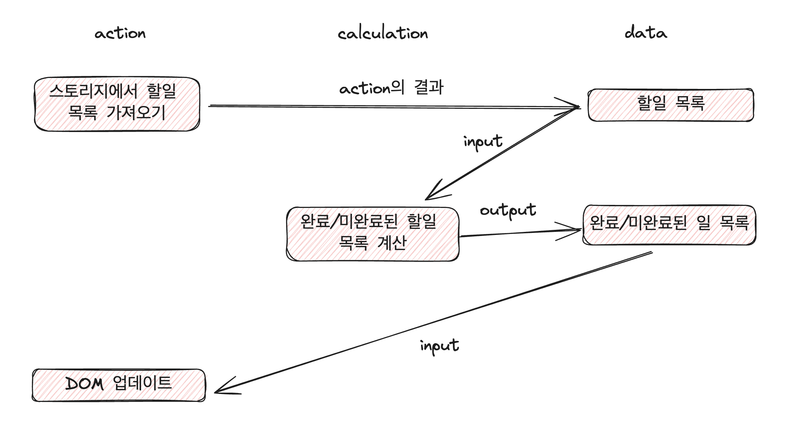

# 함수형 프로그래밍이란?

개발하다 보면 한 번쯤 함수형 프로그래밍이란 용어에 대해서 들어봤을 것이다. 과연 함수형 프로그래밍은 무엇일까?

먼저 인터넷에 등장하는 함수형 프로그래밍의 정의를 먼저 살펴보자.

> **수학 함수**를 사용하고, **부수 효과**를 피하는 것이 특징인 프로그래밍 패러다임. **부수 효과** 없이 **순수 함수**만 사용하는 프로그래밍 스타일.

수학 함수, 부수 효과, 순수 함수라는 용어가 등장한다.

- 부수 효과 (side effect)
  - 함수가 return하는 값 이외에 하는 모든 일
  - 함수 호출 시 마다 발생하므로 문제 발생 가능
- 순수 함수 (pure function)
  - 인자에만 의존하고 부수 효과가 없는 함수
  - 같은 인자라면 항상 동일 결과를 반환
  - == 수학함수. 수학에서의 함수와 동일하게 동작

정의에서 함수형 프로그래밍은 부수 효과를 매우 싫어하는 것을 느낄 수 있다. 그럼 함수형 프로그래밍은 순수함수만 사용하면 되는 것일까? 애초에, 실제 개발을 하면서 그게 가능할까?

### 함수형 프로그래밍의 오해

함수형 프로그래밍의 시초는 학문이다. [(참고: 함수형 프로그래밍의 역사)](https://tpgns.github.io/2018/03/20/the-rise-and-fall-and-rise-of-functional-programming-composable-software/)

따라서 함수형 프로그래밍의 정의를 그대로 실제 소프트웨어 개발에 맞추기에는 오해가 있다.

#### 1. 부수 효과는 필요하다.

정의에서부터 부수 효과를 피해야 한다고 하지만, 우리가 소프트웨어를 개발하는 목적은 부수 효과를 발생시키기 위함이다.
개발을 시작하면서 Todo list를 만들었는데, 할 일을 추가하는 함수를 호출할 때마다 실제 UI에는 업데이트되지 않는다면 우리가 만든 Todo list, 소프트웨어는 아무 의미가 없다.

부수 효과를 피하는 게 아니라, 필요할 때 '잘' 써야 한다.

#### 2. 함수형 프로그래밍은 부수 효과를 잘 다룰 수 있다.

부수 효과는 필요하다. 그런데 왜 이를 피하라고 했을까?

부수 효과는 위험하다. 순수하지 않은 함수는 실행될 때마다 어떤 일을 발생시킬지 예상하기 어렵기 때문에 문제가 될 수 있다. 함수형 프로그래밍은 이러한 위험을 잘 다루고자 하는 방법론이다.

#### 3. 함수형 프로그래밍은 실용적이다.

함수형 프로그래밍의 정의는 수학적이다. 이로 인해 실제 소프트웨어 개발에서 사용하기에는 너무 이상적인 프로그래밍 방식이라고 생각될 수 있다.
하지만 함수형 프로그래밍을 학문적 지식이 아닌 기술로 바라봐보자. 분명히 함수형 프로그래밍으로 만들어진 좋은 소프트웨어가 많이 있다.

또한 함수형 프로그래밍의 아름다움은 어느 프로그래밍 언어에서든지, 코드 어디에서든지 적용할 수 있다는 점이다.

이제 함수형 프로그래밍에 대한 오해를 품으로써 실제 개발에 사용해 볼 만하다는 생각이 든다. 그럼 어떻게 사용할 수 있을까?

## 함수형 사고

함수형 프로그래밍으로 소프트웨어 문제를 해결하기 위해서는 함수형 사고를 이루는 2가지 핵심을 이해해야 한다. 이 핵심이 안전하고 실용적인 프로그램을 개발하는 출발점이 된다.

#### 1. 액션, 계산, 데이터

코드를 **액션, 계산, 데이터** 3가지로 나누는 것이 함수형 프로그래밍의 기본 개념이다.
코드를 읽거나 쓸 때 항상 3가지로 구분해서 생각하고, 액션 -> 계산 -> 데이터 순으로 리팩토링할 수 있어야 하고, 액션을 잘 다루는 방법을 이해해야 한다.

#### 2. 일급추상

함수형 프로그래밍에서는 **함수에 함수를 넘겨** 더 많은 함수를 재사용한다. 이러한 방식을 어떻게 사용하는지 알아보고, 또 이를 지나치게 남용하지 않는 법을 배운다.

먼저 첫 번째 핵심인, 코드를 액션, 계산, 데이터로 구분하는 방법에 대해서 자세히 알아보자.

---

# 액션, 계산, 데이터

함수형 프로그래밍에서는 코드를 3가지로 분류한다. 각 분류가 무엇을 의미하는지 알아보자.

## 액션

> 실행 시점과 횟수에 의존하는 것

액션은 실행 시점과 횟수에 의존한다. 그리고 외부에 영향을 주거나 받는다.
그래서 순수하지 않은 함수(impure function), 부수 효과 함수(side-effecting function) 등으로도 불린다.

외부와 영향을 주고받기 때문에 액션은 다루기 힘들다. 하지만 소프트웨어를 실행하는 가장 중요한 이유이기 때문에, 꼭 써야 한다.
따라서 함수형 프로그래밍은 액션을 '잘' 쓰는 것에 집중한다.

다음은 액션을 잘 사용하기 위한 방법들이다.

- 가능한 적게 쓰기. 계산으로 대체 가능한지 고민해야 한다.
- 가능한 작게 쓰기. 액션에서 빼낼 수 있는, 액션과 관련 없는 코드는 모두 빼내야 한다.
- 소프트웨어의 내부에는 계산, 데이터만. 가장 바깥쪽에 액션이 있는 구조가 이상적이다. (어니언 아키텍처)
- 액션이 호출 시점에 의존하는 것을 제한한다. 액션이 호출 시점/횟수에 덜 의존하도록 만드는 기술을 통해 액션을 더 쉽게 사용한다.

#### 자바스크립트에서 액션의 형태

자바스크립트에서는 액션을 **함수**로 구현한다. 하지만 계산도 함수로 구현하기 때문에 구분하기 쉽지 않다.
따라서 우리가 의식적으로 이를 구분해야 하는데, 이를 위해 액션이 코드에서 주로 어떤 형태로 나타나는지 알아보자.

- 함수 호출
  - `alert("Hello World")`
  - 팝업창이 뜨는 것도 액션이다.
- 메서드 호출
  - `console.log("Hello World")`
  - 콘솔에 출력되는 것도 액션이다.
- 생성자
  - `new Date()`
  - 호출하는 시점의 날짜와 시간을 생성하기 때문에 호출되는 시점에 따라서 다른 값을 가진다. 액션이다.
- 표현식
  - 변수 참조 `y` : `y`가 공유되고 변경가능한 변수라면, 읽는 시점에 따라 값이 달라질 수 있다. 액션이다.
  - 속성 참조 `user.name` : `user`가 공유되고 변경가능한 객체라면, `name`을 읽는 시점에 따라 값이 달라질 수 있다. 액션이다.
  - 배열 참조 `todo[0]` : `todo`가 공유되고 변경가능한 배열이라면, 첫번째 항목은 읽는 시점에 따라 값이 달라질 수 있다. 액션이다.
- 상태
  - 값 할당 `x = 1` : `x`가 공유되고 있고, 변경가능한 변수라면 `x`에 값을 할당함으로써 다른 코드에 영향을 준다. 액션이다.
  - 속성 삭제 `delete user.name` : `name` 속성을 지움으로써 다른 코드에 영향을 준다. 액션이다.

호출하는 시점, 횟수에 따라서 다른 결과가 나오는 것은 모두 액션이다. 그리고 이러한 액션은 코드 전체로 퍼지기 때문에 조심해야 한다.

## 계산

> 입력값으로 출력값을 만드는 것

계산은 입력으로 출력을 만드는 것이다. 호출 시점/횟수에 의존하지 않고, 같은 입력이라면 항상 같은 출력을 반환한다. 그리고 외부에 영향을 주지 않는다.
따라서 순수 함수, 수학 함수라고도 불린다.

테스트하기 쉽고(항상 결과가 동일), 조합하기 좋다. 계산을 조합해 더 큰 계산을 만들 수 있다(일급 계산).

따라서 함수형 프로그래밍에서는 위험한 액션보다 계산을 많이 사용하려고 한다. 계산은 더 이해하기 쉽고, 호출 횟수나 시점에 따른 실행 결과를 걱정하지 않아도 된다.

하지만 계산도 액션과 마찬가지로, 실행 전까지는 어떤 일이 발생할지 알 수 없다. 물론 우리는 코드를 읽으면서 예상할 수 있지만, 소프트웨어는 결과를 실행하기 전까지 알 수 없다. 입력값으로 계산을 실행할 때 비로소 결과를 알 수 있다.
이 점이 싫다면, 실행하지 않아도 되는 데이터를 사용해야 한다.

## 데이터

> 이벤트에 대해 기록한 사실

데이터는 이벤트가 발생하고 나서 그 결과를 기록한 것이다. 데이터는 실행하지 않아도, 그 자체로 의미를 가진다. 그리고 데이터 구조(자료구조)로 데이터에 의미를 담는다. 순서가 중요하다면, 순서를 보장하는 구조를 사용한다.

자바스크립트에서는 기본 데이터 타입(숫자, 문자, 배열, 객체...)로 데이터를 구현한다.

함수형 프로그래밍에서는 데이터의 **불변성**을 지켜야한다. 이를 위해 2가지 원칙(**카피-온-라이트** / **방어적 복사**)을 사용하는데, 이는 추후에 깊게 알아본다.

---

함수형 프로그래밍의 핵심은 코드를 액션, 계산, 데이터 3가지로 구분하는 것임을 알았고, 각각이 무엇을 의미하는지도 알았다.
이제 우리는 개발 전 과정에서 3가지를 구분하기 위해 노력해야한다.

- 문제 이해 단계
  - 코드를 통해 해결하고자 하는 문제부터 3가지로 나눠 생각해 보자.
  - 액션은 문제를 풀면서 특히 주의해야 할 부분이다.
  - 계산은 문제를 풀기 위해 결정을 내리는 부분이다.
- 코드 작성 단계
  - 최대한 액션에서 계산을 빼내야 한다.
  - 계산에서 데이터를 분리할 수 있는지 생각해야 한다.
  - 즉 **액션 -> 계산 -> 데이터** 순서로 변경할 수 있는지 고민해야 한다.
- 코드 읽는 단계
  - 작성된 코드가 어느 분류에 속하는지 고민해 보자.
  - 숨어있는 액션을 찾아보고, 계산과 데이터로 리팩토링해 보자.

## 새로운 코드에 함수형 사고 적용하기

문제를 해결하기 위해 새로운 코드를 작성해야 할 때, 함수형 사고를 어떻게 적용할 수 있을지 예제로 살펴보자.
예제는 누구나 한번쯤 만들어봤을만한 Todo list를 활용한다. (참고 : 책에 등장하는 예제가 아닙니다.)

### 문제 해결 단계

코드 작성 이전에, 우리가 해결해야하는 문제(Todo list 구현)가 무엇이고 이를 위해 어떤 일들을 해야하는지, 어떤 값이 필요한지 생각해보자.

- 스토리지에서 저장된 할 일 목록 가져오기
- 전체 할 일 목록
- 미완료된 할 일 목록
- 완료된 할 일 목록
- 미완료된 할 일 필터링하기
- 완료된 할 일 필터링하기
- DOM 업데이트 (할 일 목록 노출)

이제 각각의 일이 액션, 계산, 데이터 중 어디에 속하는지 생각해보자.

- 스토리지에서 저장된 할 일 목록 가져오기 : **액션**
- 전체 할 일 목록 : **데이터**
- 미완료된 할 일 목록 : **데이터**
- 완료된 할 일 목록 : **데이터**
- 미완료된 할 일 필터링하기 : **계산**
- 완료된 할 일 필터링하기 : **계산**
- DOM 업데이트 (할 일 목록 노출) : **액션**

이제 각각의 일을 연결하여 구현하는 과정을 그림으로 그려보자.



스토리지에서 저장된 할 일 목록을 가져온다. 스토리지에 저장된 값은 시간에 따라 달라지기 때문에, 지금 가져온 목록과 내일 가져온 목록은 다를 수 있다. 따라서 이 단계는 액션이다.

가져온 할 일 목록은 데이터다. 스토리지에 접근한 이벤트의 결과이다.

완료된 일 / 미완료된 일을 필터링하여 볼 수 있도록 각각 목록을 계산한다. 그 결과로 필터링된 목록의 데이터가 생성된다.

마지막으로 이 목록을 활용해 DOM을 업데이트한다. DOM을 업데이트하는 일도 함수의 결과이고, 리턴값이 아니므로 액션이다.

### 코드 작성 단계

이제 위의 그림을 코드로 구현해보자. 여기서는 실제로 Todo list를 구현하는게 중요하지 않으므로, 추상적으로만 구현한다.

스토리지에서 저장된 할 일 목록 가져오기

```javascript
const todos = loadTodosFromStorage();
```

스토리지에서 가져온 할 일 데이터

```javascript
const todos = [
  { id: 1, text: "JavaScript 공부하기", completed: false },
  { id: 2, text: "함수형 프로그래밍 학습", completed: false },
  { id: 3, text: "투두 리스트 앱 만들기", completed: true },
];
```

완료된 할 일 / 미완료된 할 일 목록 계산 함수

```javascript
function getFilteredTodos = (todos, isCompleted) => {
  return isCompleted
    ? todos.filter((todo) => todo.completed)
    : todos.filter((todo) => !todo.completed);
};
```

필터링된 목록은 데이터

```javascript
const completedTodos = [
  { id: 3, text: "투두 리스트 앱 만들기", completed: true },
];

const notCompletedTodos = [
  { id: 1, text: "JavaScript 공부하기", completed: false },
  { id: 2, text: "함수형 프로그래밍 학습", completed: false },
];
```

DOM 업데이트는 액션(함수). 액션으로 모든 기능을 하나로 묶는다.

```javascript
function renderTodoList(todos) {
  const todos = loadTodosFromStorage();
  const notCompletedTodos = getFilteredTodos(todos, false);
  renderTodos(notCompletedTodos);
}
```

새로운 소프트웨어인 Todo list를 구현하기 위한 코드를 새로 작성해보았다.

데이터를 파악하는 것에서 시작해서 계산과 추가 데이터를 도출했다. 그리고 마지막에 액션으로 모든 것을 하나로 묶었다.
데이터는 사용하는데 제약이 많고, 액션은 가장 제약이 없다. 따라서 데이터를 먼저 구현하고, 계산을 구현한 후에 액션을 구현하는 것이 함수형 프로그래밍의 일반적인 구현 순서이다.

## 이미 있는 코드에 함수형 사고 적용하기

이제 이미 작성된 코드에는 함수형 사고를 어떻게 적용할 수 있을지 살펴보자. 코드를 읽을때도 액션, 계산, 데이터 관점으로 생각해야한다.

다음 예시는 함수형 코드가 아니다. 왜 그런지 생각해보자.

```javascript
function renderNotCompletedTodo(todo) {
  if (!todo.completed) {
    // **액션** : DOM 트리에 할일 추가
    updateTodoDom(todo);
  }
}

function renderTodoList(todos) {
  for (let i = 0; i < todos.length; i++) {
    renderNotCompletedTodo(todos[i]);
  }
}

function main(todos) {
  renderTodoList(todos);
}
```

실제로 액션은 `updateTodoDom()` 하나인 것 같은데, 액션이 하나라면 적절하게 분리되어있는게 아닐까?

`updateTodoDom()`는 실제 DOM 트리에 인자로 받은 `todo`를 추가하는 코드이다. 호출 횟수나 시점에 따라 결과가 달라지기 때문에 액션이다.

액션은 호출 시점이나 횟수에 의존한다.`renderNotCompletedTodo()` 함수는 액션인 `updateTodoDom()` 함수를 호출하므로 역시 호출 시점과 횟수에 의존하게 된다.
따라서 `renderNotCompletedTodo()` 함수도 액션이 된다.

같은 논리로 `renderTodoList()`, `main()` 함수도 액션이 된다.

즉, 코드 안쪽에 액션을 호출하는 작은 코드 하나가 전체 프로그램을 액션으로 만들었다.

**액션은 코드 전체로 퍼져나간다**. 액션을 호출하는 함수도 액션이 된다.
그래서 액션은 사용하기 어렵고, 사용할 때 조심해야한다. 앞으로 함수형 프로그래밍을 통해 이 액션을 어떻게 사용해야하는지 배우게 된다. 일단은 조심해야한다~ 까지만 이해하자.

---

함수형 프로그래밍이 무엇인지부터 시작해서, 코드에서 액션, 계산, 데이터를 구분하는 방법을 배웠다.
그리고 액션은 위험하고 어렵기 때문에 계산과 데이터로 변경해야한다는 점도 알았다.
다음 글에서 어떻게 액션을 계산으로 바꿀 수 있는지에 대해 알아보자.
