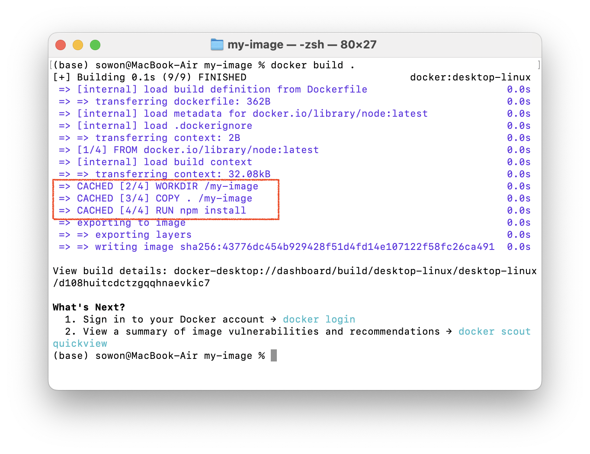
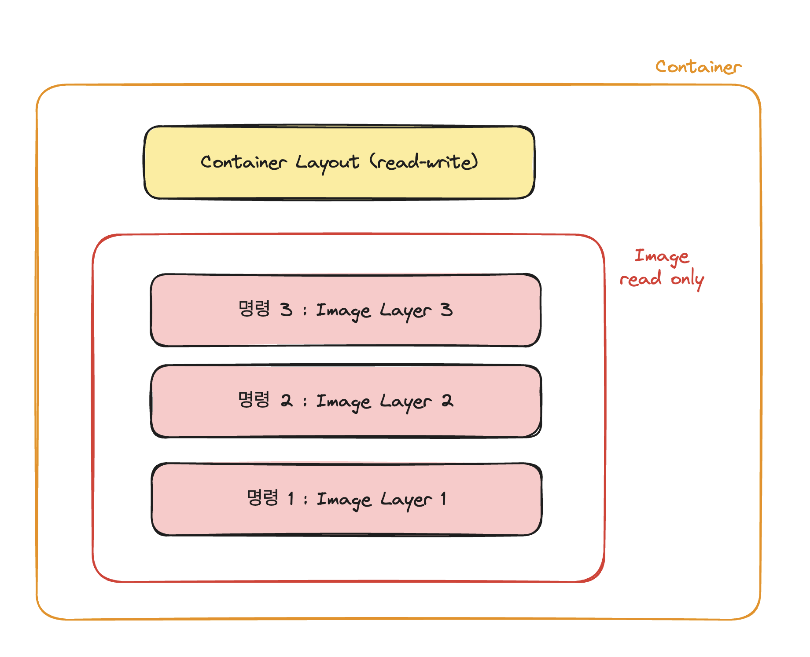
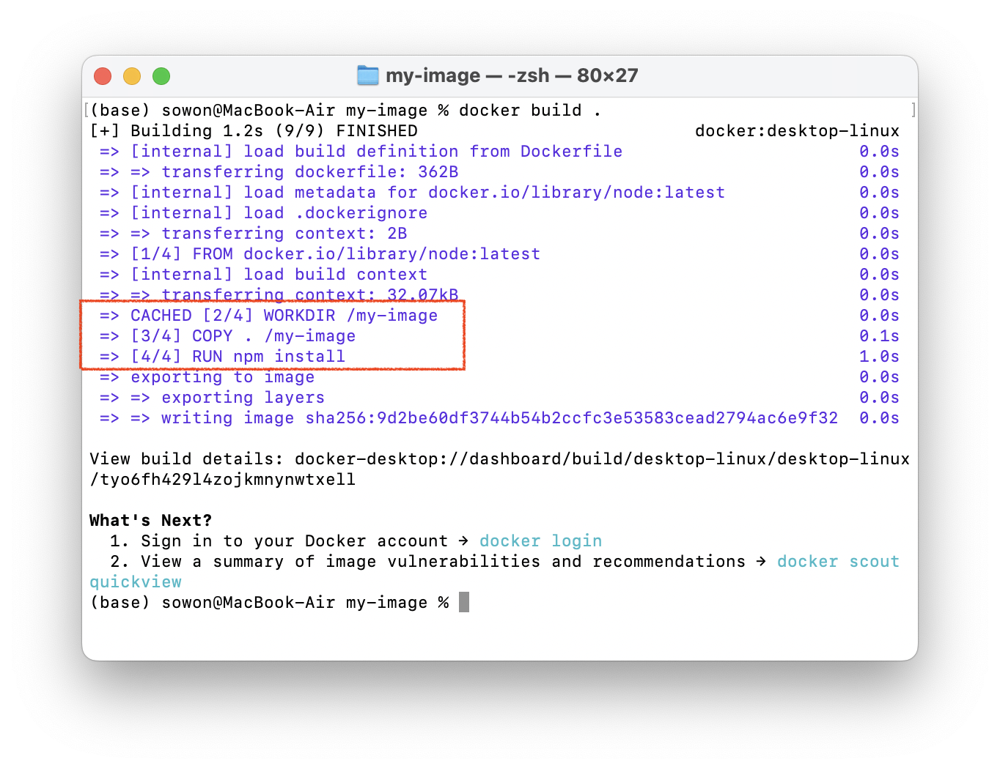
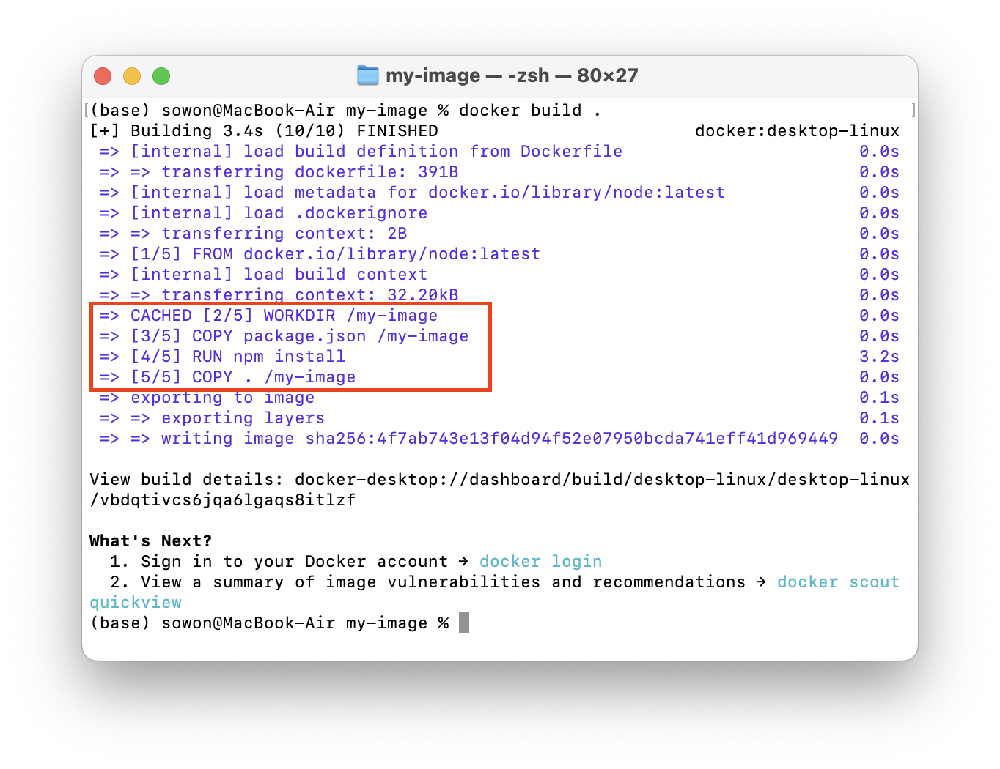
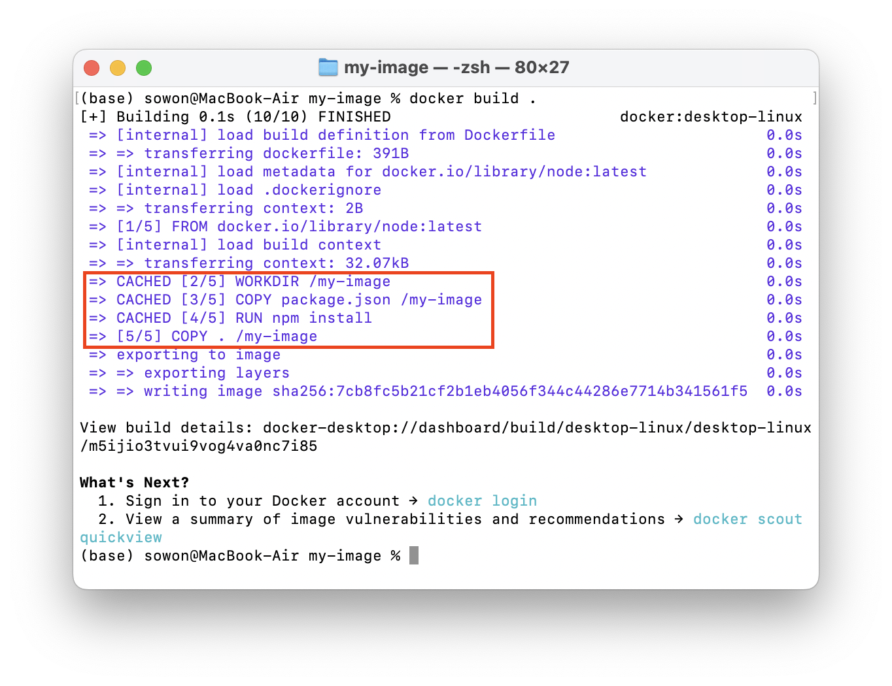

> **[Udemy Docker & Kubernetes : 실전 가이드] 정리 글**
>
> - [(1) 도커 이미지 만들기](https://wish0ne.github.io/posts/udemy-docker-kubernetes-docker-image-create/)
> - (2) 레이어 기반 아키텍처 이해하기 (now)

---

# 도커 캐시

[이전 글](https://wish0ne.github.io/posts/udemy-docker-kubernetes-docker-image-create/)을 통해 직접 도커파일을 작성하여 이미지를 만들어 보았다.

```dockerfile
# 다른 이미지를 가져옴
FROM node

# 도커 컨테이너의 작업 디렉토리 설정
WORKDIR /my-image

# 컨테이너 내부 폴더로 로컬 파일 복사
COPY . /my-image

# 명령 수행
RUN npm install

# 노출할 포트를 문서화
EXPOSE 3000

# 이미지 생성 후, 컨테이너 시작될 때 실행할 명령
CMD ["node", "index.js"]
```

이전 글에서 이미 이미지를 빌드했었지만, 다시 `docker build .` 명령으로 이미지를 재빌드해보자.



빌드가 매우 빠르게 완료되면서, `CACHED` 메세지를 확인할 수 있다.
이는 도커가 도커파일의 명령을 다시 실행할 때 그 결과가 이전과 동일하다는 것을 인식했기 때문이다.
동일한 디렉토리를 가지고 있고, `COPY`한 소스코드도 변경되지 않았으며, 새 파일도 생성되지 않았기 때문에 명령을 다시 수행할 필요가 없다고 도커는 추론한다.

이처럼 도커는 이미지를 빌드할 때마다 모든 명령의 결과를 캐싱하고, 이미지를 다시 빌드할 때 명령을 다시 수행할 필요가 없으면 이 캐시를 사용한다.
이를 **레이어 기반 아키텍처**라고 한다.

# 레이어 기반 아키텍처


도커파일의 모든 명령은 각각의 **레이어**를 나타낸다. 이미지는 다양한 명령을 기반으로 여러 레이어로 간단하게 구성된다.
그리고 이미지는 **읽기 전용**이다. 한번 명령이 실행되어 이미지가 빌드되면 이미지는 lock 되고, 이미지를 재빌드하지 않는 한 변경할 수 없다.

모든 명령을 기반으로 레이어가 생성되고, 이러한 레이어는 캐시 된다.
그리고 이 이미지를 기반으로 컨테이너를 실행하면, 컨테이너는 기본적으로 이미지 위에 새로운 레이어를 추가한다.

이렇게 되면 이미지를 실행할 때만 활성화되는 최종 레이어(`CMD` 명령으로 인한 레이어)가 추가된다.
최종 명령인 `CMD` 이전의 모든 명령(`FROM` ~ `EXPOSE`)는 이미 이미지의 일부이지만, 각각 별도의 레이어이다.

이제 소스코드를 변경한 뒤 재빌드해보자. 간단하게 `index.js` 파일의 텍스트를 변경해 준 뒤 이미지를 재빌드해준다.

```javascript
app.get("/", (req, res) => {
  // Hello World -> Hell World
  res.send("Hell World");
});
```

빌드시간이 이전보다 오래 걸리고, 출력되는 결과도 약간 다르다.


이는 레이어 캐시의 일부만을 사용하기 때문이다. `WORKDIR` 명령은 캐시를 사용했지만, `COPY` 부터는 캐시를 사용하지 않는다.
도커가 복사해야 할 파일을 스캔하고, 하나의 파일(`index.js`)이 변경된 것을 감지하여 모든 파일을 다시 복사하기 때문이다.

하나의 레이어가 변경될때마다, **변경된 레이어 이후의 모든 레이어는 다시 빌드**된다.
사실 우리는 `index.js` 파일만 수정했을 뿐, `package.json` 파일은 건드리지 않았으므로 `npm install`을 다시 수행해도 동일한 결과가 나오겠지만 도커는 변경한 파일이 영향을 줄 수 있는 위치 등에 대한 심층분석을 수행하지 않는다.
따라서 도커는 `npm install`이 이전과 동일한 결과를 산출할지 그 여부를 알 수 없다.
단지 **한 레이어가 변경될 때마다 모든 후속 레이어를 다시 실행**한다. 따라서 `RUN` 명령도 다시 실행된다. (`WORKDIR`은 변경 이전의 레이어이므로 캐시를 사용한다.)

도커는 다시 실행해야 하는 항목부터 이후의 레이어들만 다시 빌드하고 실행하여 이미지 생성 속도를 높인다.
하지만 우리가 `package.json`에서 무언가를 변경하지 않는 한 `npm install`을 다시 실행하는 것이 불필요함을 알고 있는 것에 반해, 도커는 소스코드에서 무엇인가가 변경될 때마다 `npm install`을 다시 실행한다.

여기서 우리는 도커파일에 대한 첫 번째 최적화 가능성 부분을 찾을 수 있다.

## 도커파일 최적화 (1)

모든 파일을 복사한 다음 `npm install`을 실행하는 대신, (1) `npm install`을 실행하기 전에 `package.json`을 `/my-image`에 복사하고 (2) `npm install` 실행 이후에 모든 파일을 복사함으로써 이미지 빌드 성능을 높일 수 있다.

```dockerfile
FROM node

# 도커 컨테이너의 작업 디렉토리 설정
WORKDIR /my-image

COPY package.json /my-image

# 명령 수행
RUN npm install

# 컨테이너 내부 폴더로 로컬 파일 복사
COPY . /my-image

# 노출할 포트를 문서화
EXPOSE 3000

# 이미지 생성 후, 컨테이너 시작될 때 실행할 명령
CMD ["node", "index.js"]
```

이제 소스코드를 복사하기 전에 앞의 레이어인 `npm install` 레이어가 무효화되지 않는다.

도커파일을 변경한 뒤 이미지를 빌드해보자.


그리고 소스코드(`index.js`)를 다시 변경한 뒤 재빌드해보자.


`package.json`을 복사하고 `npm install` 명령을 수행하는 레이어가 캐시를 사용했다. 이제 소스코드를 변경하더라도 불필요한 `npm install`이 다시 수행되지 않는다. 🥳

---

도커는 결국 우리가 만들고자 하는 애플리케이션의 모든 것이다. 애플리케이션을 구성하는 코드와 코드를 실행하는 데 필요한 실행 환경을 **이미지**에 집어넣는다.
우리는 **도커파일**을 만듦으로써 이런 이미지를 생성하고 세부적인 명령을 집어넣는다.

이미지에는 이렇게 코드가 포함되어 있고, 컨테이너는 이미지 위에 추가된 얇은 **레이어**일 뿐이다.

여기서 중요한 점은 컨테이너가 이미지에서 코드와 환경을 **컨테이너로 복사하지 않는다는 것**이다. 컨테이너는 이미지에 저장된 환경을 사용하고, 그 위에 부가 레이어를 추가하는 것이다.

예를 들어 하나의 이미지와 두 개의 컨테이너가 있는 경우를 생각해 보자. 이미지는 노드 서버 프로세스를 담고 있다. 노드 애플리케이션을 실행하기 위해서는 리소스, 메모리 등을 할당해야 하지만, 코드를 복사하지는 않는다.
2개의 컨테이너는 이미지에 있는 코드를 활용함으로 우리의 코드는 매번 복사되지 않게 된다.

도커는 이렇게 매우 효율적인 방식으로 애플리케이션에 필요한 모든 것을 관리한다. 애플리케이션을 포함하는 격리된 환경과, 그 애플리케이션을 실행하는 데 필요한 모든 것을 격리된 컨테이너 내부에 모두 포함시키는 것이 도커이다.
