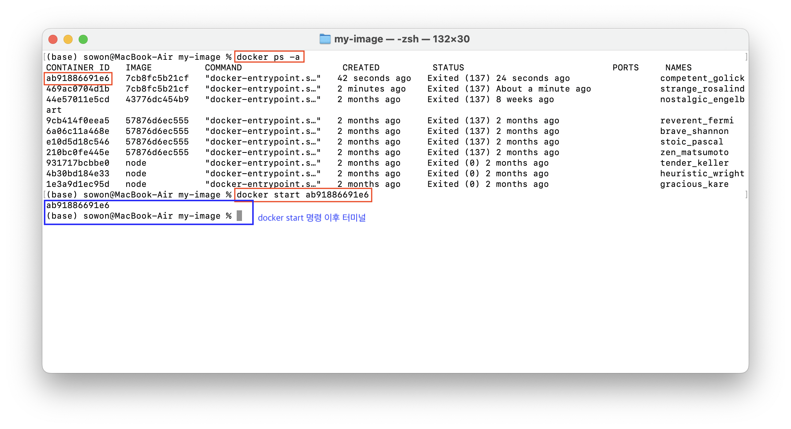

> **[Udemy Docker & Kubernetes : 실전 가이드] 정리 글**
>
> - [(1) 도커 이미지 만들기](https://wish0ne.github.io/posts/udemy-docker-kubernetes-docker-image-create/)
> - [(2) 레이어 기반 아키텍처 이해하기](https://wish0ne.github.io/posts/udemy-docker-kubernetes-docker-layer-architecture/)
> - (3) Attached vs Detached 모드 이해하기 (now)

---

벌써 도커파일을 작성해서 이미지를 빌드하고 컨테이너를 실행시킬 수 있게 되었고,
도커의 레이어 기반 아키텍처를 엿보면서 도커 캐시를 이용한 최적화 방법을 맛봤다.

이제 좀 더 실용적인, 이미지와 컨테이너를 구성하고 관리하는 방법에 대해서 알아보자.

> TIP 💡 <br/>
> 모든 도커 명령에 `--help`를 추가하면 사용가능한 모든 옵션을 확인할 수 있다. 앞으로 나올 모든 도커 명령에 `--help`를 붙여서 확인해보자. (귀찮으니까 글에서는 생략하겠다는 말)
>
> <br />
>
> ```shell
> # 실행가능한 모든 도커 내장 명령 목록 확인
> docker --help
> ```
>
> 

---

# 컨테이너 목록 확인

[docker.docs : docker conatiner ls 참고](https://docs.docker.com/reference/cli/docker/container/ls/)

우리는 이미 **실행중인** 컨테이너 목록을 확인할 때 `docker ps` 명령을 사용했다. 그런데 왜 `ps`가 컨테이너 리스트를 보여주는 명령일까?

사실 `docker ps` 명령은 `docker container ls` 명령의 단축버전이다. 😯

```shell
docker conatiner list
== docker conatiner ls
== docker container ps
== docker ps
```


<br />

`-a` 옵션은 **모든** 컨테이너 목록을 확인할 수 있게 한다. 즉 `-a` 옵션이 없는 디폴트 명령은 오직 `running` 상태의 컨테이너만을 보여준다. ([참고 : 컨테이너 status 값 종류](https://docs.docker.com/reference/cli/docker/container/ls/#status))

```shell
# 전체 컨테이너 목록 확인
docker ps -a
```


---

# 컨테이너 재시작

[docker.docs : docker conatiner run 참고](https://docs.docker.com/reference/cli/docker/container/run/)

지금까지는 컨테이너를 실행시킬 때 `docker run <이미지 ID>` 명령만을 사용했다.

이 명령은

1. `<이미지 ID>` 이미지를 기반으로 새 컨테이너를 생성
2. 새 컨테이너를 시작

즉 명령을 수행할때마다 항상 새로운 컨테이너가 만들어지고 시작되게 된다.

하지만... 만약 이전에 이미 실행한적이 있는(지금은 중지된) 컨테이너와 차이점 없이, 똑같은 컨테이너를 다시 실행하고 싶다면? 굳이 새 컨테이너를 생성할 필요가 없다. 기존 컨테이너를 **재시작**하면 된다.

`docker ps -a`를 통해 중지된 컨테이너를 포함한 목록을 확인하자. 최근에 작업한 도커 컨테이너 히스토리를 확인할 수 있다.

그리고 원하는 컨테이너 이름 또는 ID를 이용해 컨테이너를 재시작시키자.

```shell
# 중지된 컨테이너 시작
docker start <컨테이너 이름 | ID>
```



그럼 중지된 컨테이너를 재시작할 수 있다. 그런데 좀 다르게 컨테이너가 시작된다?


`docker run <이미지 ID>` 명령을 실행한 이후에는 터미널에 다른 명령이나 텍스트를 아예 입력할 수 없었다.
반면 `docker start <컨테이너 이름 | ID>` 명령을 실행한 이후에는 터미널이 차단되지 않고, 다른 명령을 계속 입력할 수 있었다.

그렇다면... 컨테이너는 제대로 재시작되어 실행중인건 맞을까? 실행중이라면 터미널이 차단되어야 하는거 아닐까? 🤔

의문을 해소하기 위해 `localhost:3000`에 접속해서 확인해보자.


Hello World를 확인할 수 있다. 😦 컨테이너 재시작 후에 터미널에서 컨테이너 환경과 상호작용하거나 로그를 확인할 순 없었지만, 실제로 컨테이너는 재시작되어 실행중이였다.

그럼... 두 명령의 차이점은 무엇일까?

# Attached & Detached 컨테이너

두 명령을 입력했을 때 상황이 달랐던 이유는,
컨테이너를 **새로 시작**했을때(`docker run`)와 / 컨테이너를 **재시작**했을때(`docker start`)의 **모드**가 다르기 때문이다.

## Detached 모드 (분리 모드)

`docker run` 명령을 통해 컨테이너를 새로 시작하면, 이 프로세스에서 터미널이 막힌다.
터미널에서 더 이상 다른 명령을 실행할 수 없다.

이는 **컨테이너가 포그라운드에서 실행중**이기 때문에, 이 프로세스가 터미널을 차단하고 있다.
`docker run`으로 시작하는 경우 detached 모드가 디폴트가 된다.

## Attached 모드 (연결 모드)

`docker start` 명령을 통해 컨테이너를 재시작하면, 프로세스가 즉시 완료되고 터미널에서 다른 명령을 실행할 수 있다.

이는 **컨테이너가 백그라운드에서 실행중**이기 때문에, 실행중인 컨테이너에 터미널을 연결하지 않기 때문이다.
중요한 것은 컨테이너가 여전히 실행중이라는 점! 단지 터미널에 연결하지 않을 뿐이다.

`docker start`으로 시작하는 경우 attached 모드가 디폴트가 된다.

---

왜 도커는 2가지 모드를 제공할까? 또 어떤 모드를 사용하는게 좋을까?

우리의 매우 간단한 Hello World 웹 애플리케이션 코드를 살펴보면, 애플리케이션 실행 시 콘솔을 찍고 있다.

```javascript
app.get("/", (req, res) => {
  res.send("Hello World");
});

app.listen(port, () => {
  // 메세지를 콘솔에 찍는 부분
  console.log(`Example app listening on port ${port}`);
});
```

하지만 detached 모드로 시작된 컨테이너에는 터미널에 콘솔이 찍히지 않았다.


반면 docker run을 실행했을때는 터미널에 콘솔이 찍혔다. attached 모드로 실행되어 컨테이너에 터미널이 연결되어 있기 떄문이다.


즉 attached 모드는, 단순히 콘솔 등의 **컨테이너의 출력결과를 수신**한다는 것을 의미한다.

<br />

## 모드 변경해서 컨테이너 실행하기

새 컨테이너를 시작할때마다 `docker run` 명령이 컨테이너를 터미널에 연결하는 것이 싫다면, 물론 detached 모드에서도 실행할 수도 있다.

```shell
# detached 모드로 docker run 명령 실행
docker run -d <이미지 id>

# 분리된 컨테이너를 다시 연결
docker container attach <컨테이너이름>
```

`-d` 플래그로 실행하면 컨테이너의 출력과 연결되지 않기 때문에 콘솔을 확인할 수 없다. 대신 하나의 터미널에서 다른 작업을 수행할 수 있다는 장점이 있다.

반대로 중지된 컨테이너를 재시작할 때 항상 컨테이너와 연결되지 않는게 싫다면,

```shell
docker start -a <이름>
```

`-a` 플래그를 통해 attached 모드로 컨테이너를 바로 재시작할 수 있다.

<br />

## Detached 모드의 컨테이너와 연결하기

한번 detached 모드로 실행된 컨테이너의 콘솔은 컨테이너를 재시작할때까지 확인할 수 없는 걸까? 😭

물론 그럴리가 없다. detached 모드에서 실행중인 컨테이너와 연결되고 싶다면 두가지 방법이 있다.

#### 1. attach 명령

[docker.docs : docker conatiner attach 참고](https://docs.docker.com/reference/cli/docker/container/attach/)

실행중인 컨테이너에 연결한다.

```shell
# 컨테이너 연결
docker attach <컨테이너 이름 | id>
```

#### 2. docker logs

[docker.docs : docker conatiner logs 참고](https://docs.docker.com/reference/cli/docker/container/logs/)

컨테이너에 의해 출력된 로그들을 가져온다.

```shell
# 컨테이너에 출력된 로그들을 가져오는 명령
docker logs <컨테이너 이름 | id>
```

`-f` 플래그를 통해 follow 모드로 진입해서 계속 수신대기할 수 있다. attach 모드로 연결된 프로세스를 다시 갖게되며, 컨테이너가 앞으로 출력하는 결과를 다시 볼 수 있게 된다.

```shell
# follow 모드로 진입하여 컨테이너에 출력되는 로그들을 가져옴
docker logs -f <컨테이너 이름 | id>
```

---

실행중인 컨테이너와 중지된 컨테이너, 연결된 컨테이너와 분리된 컨테이너의 차이점을 이해하는 것이 중요하다.
연결되거나 분리된 컨테이너 모두 실행중인 컨테이너이며, 단지 컨테이너 출력을 수신대기하느냐가 다르다는 것을 기억하자.
