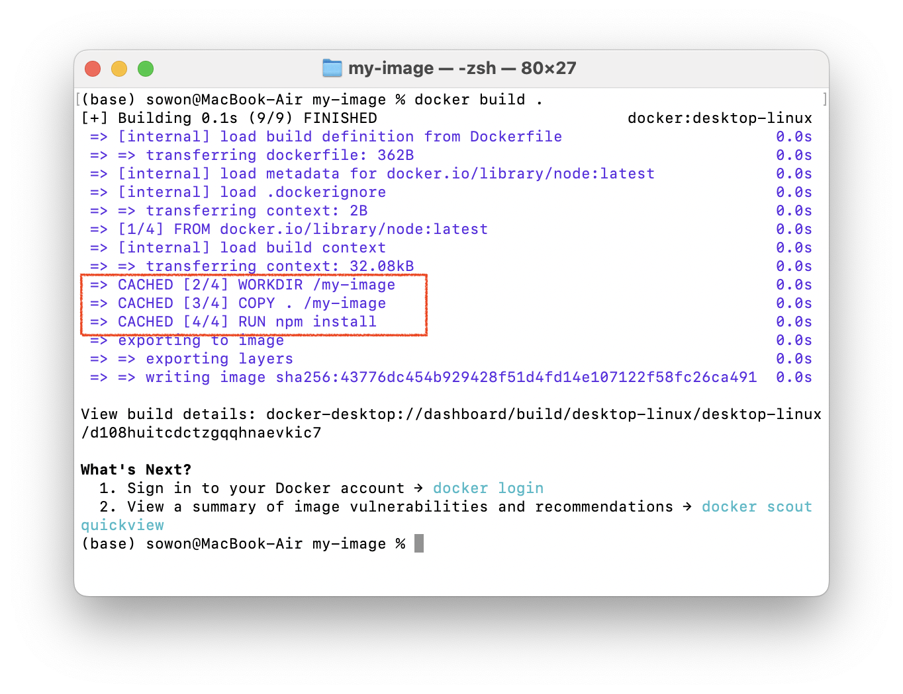
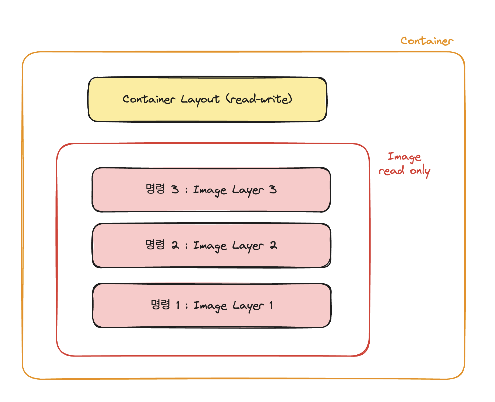
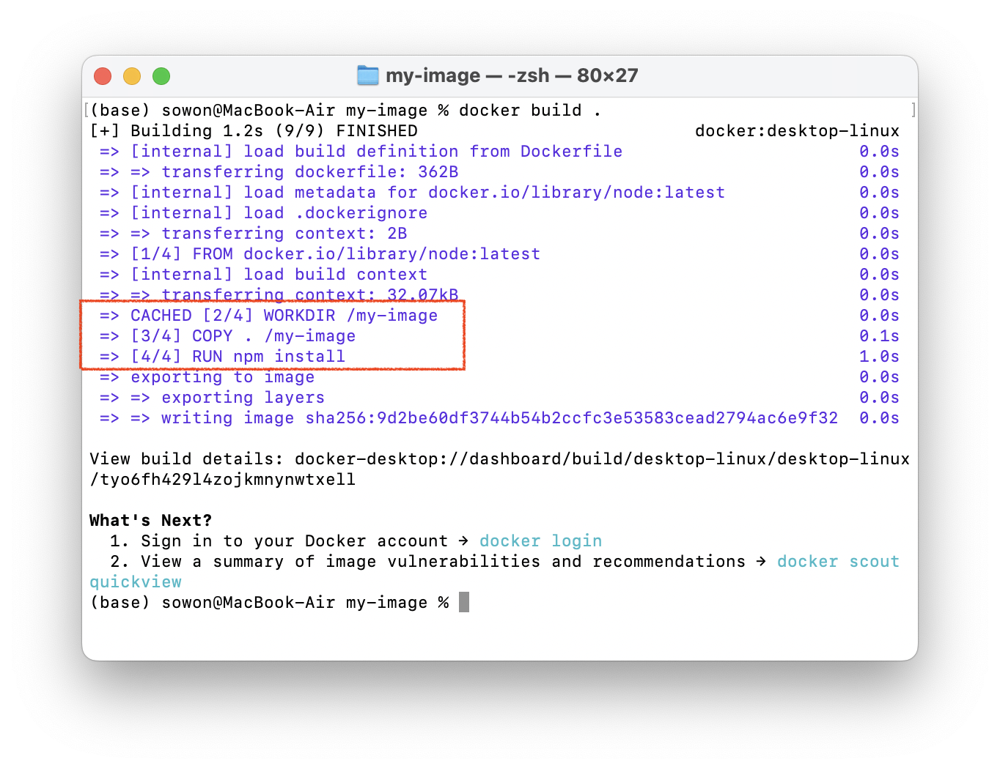
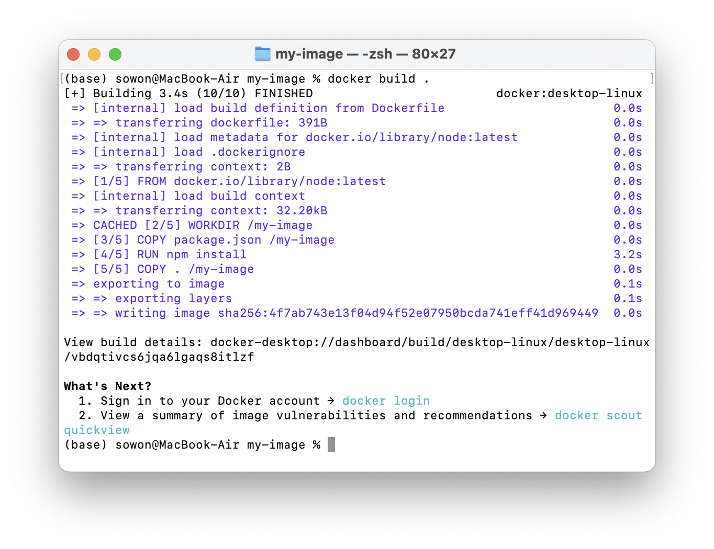
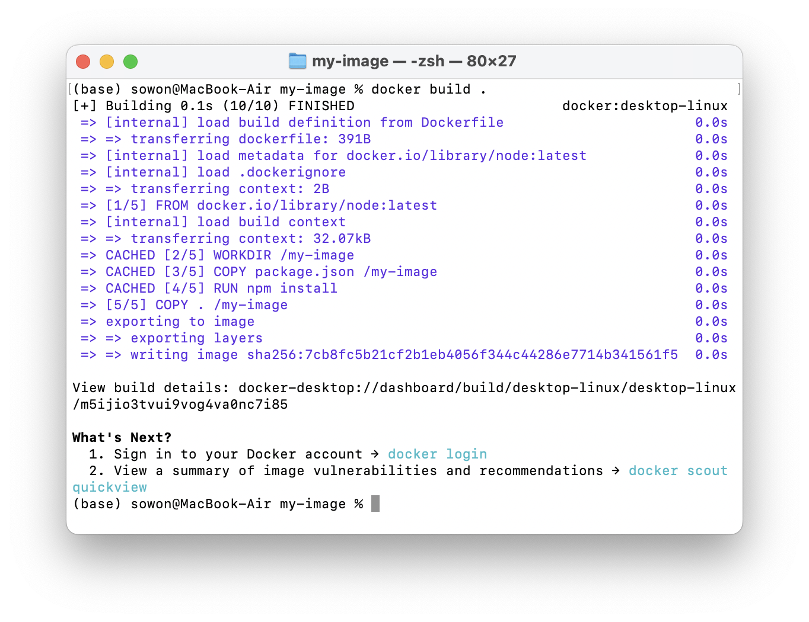

> [Udemy Docker & Kubernetes : 실전 가이드] 정리글
>
> - [(1) 도커 이미지 만들기](https://wish0ne.github.io/posts/udemy-docker-kubernetes-docker-image-create/)
> - (2) 레이어 기반 아키텍처 이해하기

---

# 이미지 빌드 시 캐시 사용

[저번 글](https://wish0ne.github.io/posts/udemy-docker-kubernetes-docker-image-create/)을 통해 직접 도커파일을 작성하여 이미지를 만들어보고, 실행시켜보았다.

```dockerfile
# 다른 이미지를 가져옴
FROM node

# 도커 컨테이너의 작업 디렉토리 설정
WORKDIR /my-image

# 컨테이너 내부 폴더로 로컬 파일 복사
COPY . /my-image

# 명령 수행
RUN npm install

# 노출할 포트를 문서화
EXPOSE 3000

# 이미지 생성 후, 컨테이너 시작될 때 실행할 명령
CMD ["node", "index.js"]
```

이미 빌드한 이미지를 `docker build .`로 다시 빌드해보자.



빌드가 매우 빠르게 완료되면서, `CACHED` 메세지를 확인할 수 있다.
이는 도커가 도커파일의 모든 명령에 대해서, 다시 실행했을때의 결과가 이전과 동일하다는 것을 인식했기 때문이다.
동일한 디렉토리를 가지고 있고, COPY한 코드도 변경되지 않았으며 새 파일도 생성되지 않았기 때문에 명령을 다시 수행할 필요가 없다고 도커는 추론한 것이다.

도커는 이미지를 빌드할 때 마다 모든 명령의 결과를 캐싱하고, 이미지를 다시 빌드할 때 명령을 다시 수행할 필요가 없으면 이 캐시를 사용한다.
이를 **레이어 기반 아키텍처**라고 한다.


모든 명령은 도커파일의 레이어를 나타낸다. 이미지는 다양한 명령을 기반으로 여러 레이어에서 간단하게 구성된다.
이미지는 읽기 전용이다. 한번 명령이 실행되어 이미지가 빌드되면 이미지는 lock 되고, 이미지를 재빌드하지 않는 한 변경할 수 없다.

모든 명령을 기반으로 레이어가 생성되고, 이러한 레이어는 캐시된다.
그리고 이 이미지를 기반으로 컨테이너를 실행하면, 컨테이너는 기본적으로 도커파일에 지정한 명령을 실행한 결과로 이미지 위에 새로운 레이어를 추가한다.
-> 이렇게 되면 이미지를 레이어로 실행할때만 활성화되는 최종 레이어(`CMD` 명령으로 인한 레이어)가 추가된다.
최종 명령인 `CMD` 이전의 모든 명령(`FROM` ~ `EXPOSE`)는 이미 이미지의 일부이지만, 별도의 레이어이다.
아무것도 변경되지 않으면 이러한 레이어의 캐시를 사용할 수 있다.

이제 소스코드를 변경한 뒤 재빌드해보자. index.js 파일의 텍스트를 변경해준다.

```javascript
app.get("/", (req, res) => {
  res.send("Hell World");
});
```

빌드시간이 아까보다 오래걸린다.


이는 레이어 캐시의 일부만을 사용하기 때문이다. `WORKDIR` 명령은 캐시를 사용했지만, `COPY` 부터는 캐시를 사용하지 않는다.
도커가 복사해야할 파일을 스캔하고 하나의 파일이 변경된것을 감지하여 모든 파일을 다시 복사하기 때문.

하나의 레이어가 변경될때마다, 변경된 레이어 이후의 모든 레이어가 다시 빌드된다고 말했음(레이어 변경 후의 모든 레이어)
도커는 `npm install`이 이제 이전과 동일한 결과를 산출할지 그 여부를 알 수 없음.
결국 도커는 영향을 줄 수 있는 위치와 변경한 파일에 대한 심층분석을 수행하지 않음.
-> 한 레이어가 변경될때마다, 모든 후속 레이어도 다시 실행되므로 RUN 명령도 다시 실행됨. (WORKDIR은 변경 이전의 레이어이므로 캐시결과 사용함)

# 레이어 기반 아키텍처

도커는 다시 실행해야 하는 항목만 다시 빌드하고 다시 실행하여, 이미지 생성 속도를 높이기 위해 존재한다.
즉 우리가 코드에서 무엇인가를 변경할 때마다 `npm install`을 다시 실행함을 의미함.
이게 불필요함에도 불구하고.
`package.json`에서 무언가를 변경하지 않는 한 다시 실행할 필요가 없음.
-> 도커파일에 대한 첫번째 최적화 가능성 부분

## 도커파일 최적화 (1)

모두 복사한다음 npm install을 실행하는 대신, npm install 후에 모두를 복사하고, npm install을 실행하기 전에
package.json 파일도 /app에 복사하는 것.

```dockerfile
FROM node

# 도커 컨테이너의 작업 디렉토리 설정
WORKDIR /my-image

COPY package.json /my-image

# 명령 수행
RUN npm install

# 컨테이너 내부 폴더로 로컬 파일 복사
COPY . /my-image

# 노출할 포트를 문서화
EXPOSE 3000

# 이미지 생성 후, 컨테이너 시작될 때 실행할 명령
CMD ["node", "index.js"]
```

-> 소스코드를 복사하기 전에 npm install 레이어가 오게됨
따라서 앞으로는 소스코드를 변경할 때마다 소스코드 복사 명령 앞의 이러한 레이어가 무효화되지 않음.
npm install을 다시 실행하는 것보다 성능이 좋을 것

도커파일을 변경한 뒤 이미지를 빌드해보자.


그리고 소스코드를 다시 변경한뒤 재빌드해보자.


---

도커는 결국 우리가 만들고자 하는 애플리케이션의 모든 것이다.

웹 애플리케이션을 만들고자 할때, 애플리케이션을 구성하는 코드와 코드를 실행하는데 필요한 실행환경을 이미지에 집어넣는다.

우리는 도커파일을 만듦으로써 이런 이미지를 생성하고 세부적인 명령을 집어넣는다.

도커는 궁극적으로 이미지가 아닌 컨테이너에 관한 것이다. 하지만 이미지가 컨테이너의 템플릿이므로 중요하다.
이미지를 기반으로 여러 컨테이너를 실행할 수 있다.

- 이미지 : 작성한 코드가 포함된 것
- 컨테이너 : 이미지 위에 추가된 얇은 레이어일 뿐

컨테이너는 이미지를 기반으로 하는 실행 애플리케이션.
일단 실행되면 실행중인 컨테이너와는 다르게 독립적이다.

강조하고 싶은 것은, 컨테이너가 이미지에서 코드와 환경을 새 컨테이너로 복사하거나 새 파일로 복사하지 않는다는 것이다.
컨테이너는 이미지에 저장된 환경을 사용한다.
그런 다음 위에 부가 레이어를 추가한다.

예를들어 실행중인 노드 서버 프로세스는 애플리케이션을 실행하기 위해 리소스, 메모리 등을 할당한다.
하지만 코드를 복사하지는 않는다. 따라서 우리의 코드와 노드 환경은 세번이나 복사되지 않는다.

하나의 이미지와 두개의 컨테이너가 있는 경우 이미지와 컨테이너에 한번만 존재하므로, 그 이미지와 그 안의 코드를 활용한다.
이것이 도커가 이를 관리하는 방법이며, 매우 효율적이다.
앱을 포함하는 격리된 환경과 그 앱을 실행하는데 필요한 모든 것, 모든 환경, 도구, 그러한 것을 이 격리된 컨테이너 내부에 모두 포함하는 것. 이게 도커이다.
